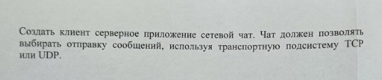

# Client-Server TCP\UDP chat

## Use cases

### Server

- Start on specified address (IP + port) and transport protocol (UDP or TCP)
- Stop
- Keeping chat massages info
- Keeping chat members info
- Get message from client
- Send chat members info to clients
- Send chat massages info to clients

### Client

- Connect to server with specified address
- Disconnect
- Write message
- Get message from server
- *Delete message*
- *Edit message*
