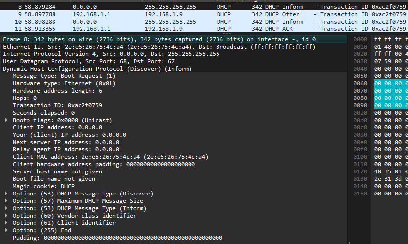

# DHCP

## 1. Настройка DHCP-сервера

Ниже будет указана базовая настройка DHCP-сервера в консоли роутера Cisco 3745 в GNS3.

```console
## (a) Определение пула адресов
## Переходим в режим настройки dhcp пула с помощью команды `ip dhcp pool [pool-name]`
R1(config)#ip dhcp pool lan0
## С помощью команды `network [ip-address] [subnet-mask]` настраиваем пул выдаваемых адресов
## (Не забудьте настроить статический IP-адрес на порту роутера)
R1(dhcp-config)#network 192.168.1.0 255.255.255.0
## (b) Определение аренды
## Для этого воспользуемся командой `lease [days: 0-365] [hours: 0-23] [minutes: 0-59]`
R1(dhcp-config)#lease 0 10 0
## (c) Задать шлюз
## Для этого воспользуемся командой `default-router [gateway-ip-address]`
R1(dhcp-config)#default-router 192.168.1.1
## (d) Задать DNS адреса
## Для этого воспользуемся командой `dns-server [dns-ip-1] [dns-ip-2] ... [dns-ip-n]`
R1(dhcp-config)#dns-server 1.1.1.1 77.88.8.8 8.8.8.8
```

## 2. При помощи анализатора трафика проследить цепочки DHCP сообщений

### DHCP discover -> DHCP offer

Для того, чтобы обнаружить dhcp-сервер в сети, dhcp-клиент отправляет сообщение обнаружения (`DISCOVER`) на *broadcast*  MAC и IP адреса по UDP порту 68 на порт 67. DHCP-сервер в ответ отправляет предложение адреса (`OFFER`) по *unicast* и UDP порту 67 на порт 68, с предлагаемым адресом клиенту по UDP.


### DHCP request -> DHCP acknowledgement

На предложение клиент отвечает запросом (`REQUEST`) или отказом от предложения (`DECLINE`). В случае `REQUEST`, сервер отвечает `ACKNOWLEDGEMENT` (`ACK`) или `NEGATIVE ACKNOWLEDGEMENT` (`NAK`), в случае отказа выдачи запрошенного клиентом адреса.


Когда сервер посылает `ACKNOWLEDGEMENT`, завершается цикл `DORA`, названный в честь первых букв указанных выше *успешных* сообщений. А завершение этого цикла означает успешное получение адреса.

*Также есть сообщения из группы `RIND` - `RELEASE`, `INFORM`, `NEGATIVE ACKNOWLEDGEMENT` и `DECLINE`*.

## 3. Проследить цепочки DHCP после отправки сообщения DHCP release. Отдельно отследить DHCP сообщения после выполнения команды `Renew`

### DHCP release

> DHCPRELEASE - Клиент сообщает серверу об освобождении сетевого адреса и отказе от аренды. [3]

`PC1> dhcp -x`


### Renew

В отличии от обычного DHCP discover, в данном случае присутствует опция № 50, запрошенного IP-адреса, который раннее был выдан DHCP-клиенту.

`PC1> dhcp -r`


В остальном (offer, request, acknowledgement) сообщения не отличаются от первичной выдачи адреса.

## 4. Проанализировать сообщения DHCPINFORM при разных конфигурациях DHCP сервера

> `DHCPINFORM`Клиент запрашивает у сервера только конфигурационные параметры, поскольку уже имеет сетевой адрес, заданный другим способом. [3]

### Попытка с использованием `udhcpc` на `Alpine Linux`

```
/ # udhcpc --help
Usage: udhcpc ...

        ...

        -o              Don't request any options (unless -O is given)
        -O OPT          Request option OPT from server (cumulative)
        -x OPT:VAL      Include option OPT in sent packets (cumulative)
                        Examples of string, numeric, and hex byte opts:
                        -x hostname:bbox - option 12
                        -x lease:3600 - option 51 (lease time)
                        -x 0x3d:0100BEEFC0FFEE - option 61 (client id)
                        -x 14:'"dumpfile"' - option 14 (shell-quoted)

        ...

/ # udhcpc -o -x 53:8
udhcpc: started, v1.36.1
udhcpc: broadcasting discover
udhcpc: broadcasting select for 192.168.1.9, server 192.168.1.1
udhcpc: lease of 192.168.1.9 obtained from 192.168.1.1, lease time 36000 
```

Итог



### Попытка с использованием `ipconfig` на `Windows 10`

```
PS C:\Users\NemoNology> ipconfig /setclassid “Ethernet” DHCPINFORM

Настройка протокола IP для Windows

Код класса DHCPv4 для адаптера Ethernet успешно установлен.
```


### Использование UDP сокета на Python3 с байтами, основанными на байтах показанного выше пакета


### Попытка с использованием `dhcping` на `Alpine Linux`

```
/ # dhcping -c 192.168.1.2 -s 192.168.1.1 -i
Got answer from: 192.168.1.1
```


## 5. Смоделировать ситуации для генерации сообщения DHCPNACK

> `DHCPNAK` - Сервер сообщает клиенту о непригодности указанного тем сетевого адреса (например, при переносе клиента в другую подсеть) или окончании аренды для этого клиента. [3]

### a. DHCP REQUEST c опцией `55` от клиента одной подсети в другую подсеть

Получаем IP-адрес от DHCP-сервера одной подсети, а затем переносим клиента в другую подсеть.


### b. DHCP REQUEST с опцией `50` с запросом занятого IP-адреса

Формируем DHCP REQUEST, с опцией запрошенного IP-адреса (опция `50`), и в виде запрошенного адреса указываем, например, адрес DHCP-сервера;


## 6. Смоделировать ситуации для генерации сообщения DHCPDECLINE

> `DHCPDECLINE` - Клиент сообщает серверу о том, что сетевой адрес уже занят. [3]

### a. НЕУДАЧНО. Наличие предлагаемого адреса в ARP таблице клиента

Добавляем ARP запись клиенту;

```console
/ # arp -s 192.168.1.5 00:50:79:66:68:02 -i eth0
/ # arp -a -n
? (192.168.1.5) at 00:50:79:66:68:02 [ether] PERM on eth0
...
```

Попытка получить IP-адрес

```console
/ # dhcpcd eth0
...
eth0: offered 192.168.1.5 from 192.168.1.1
eth0: probing address 192.168.1.5/24
eth0: leased 192.168.1.5 for 86400 seconds
...
```


#### Причина неудачи

Клиент перепроверяет занятость IP для надёжности, не считаясь с ARP таблицей.

### b. НЕУДАЧНО. Занятой адрес у компьютера, о котором знает только клиент

Подключаем ко 2-ому сетевому входу компьютер и прописываем ему статический адрес;


```console
PC1> ip 192.168.1.8/24 192.168.1.1
Checking for duplicate address...
PC1 : 192.168.1.8 255.255.255.0 gateway 192.168.1.1
```

Попытка получить IP-адрес

```console
/ # dhcpcd eth0
...
eth0: offered 192.168.1.8 from 192.168.1.1
eth0: ignoring offer of 192.168.1.8 from 192.168.1.1
eth0: probing address 192.168.1.8/24
eth0: leased 192.168.1.8 for 86400 seconds
...
```

#### Причина неудачи

PC1 находится в другой LAN.

### c. НЕУДАЧНО. Занятый вторым сетевым портом адрес у клиента

Назначаем второму сетевому порту статический IP-адрес, который является следующим предложением сервера;

```console
/ # ip addr add 192.168.1.10 dev eth1
/ # ip a
...
10: eth1: ...
        inet 192.168.1.10/32 scope global eth1
        ...
```

Попытка получить IP-адрес

```console
/ # dhcpcd eth0
...
eth0: offered 192.168.1.10 from 192.168.1.1
eth0: probing address 192.168.1.10/24
eth0: leased 192.168.1.10 for 86400 seconds
...
```

#### Причина неудачи

[См. причину здесь](#b-неудачно-занятой-адрес-у-компьютера-о-котором-знает-только-клиент).

### d. Заём адреса клиента другим хостом и попытка клиента DHCPRENEW

Отсоединяем свободный хост от LAN и присваиваем ему адрес клиента;


```console
PC2> ip 192.168.1.8/24 192.168.1.1
Checking for duplicate address...
PC2 : 192.168.1.8 255.255.255.0 gateway 192.168.1.1
```

Присоединяем свободный хост к LAN и посылаем DHCPRENEW от клиента;


```console
/ # dhcpcd eth0 -n
sending signal HUP to pid 435
```


### Отдельно отследить работу ARP в ситуации с сообщением DHCPDECLINE

После получения `DHCPACK`, клиент проверяет занятость выданного адреса путём ARP;
При занятости адреса, клиент отправляет `DHCPDECLINE` и начинает `DORA` вновь;

## 7. Анализ продления аренды

> Клиент поддерживает параметры T1 и T2, определяющие момент, когда он пытается продлить свою аренду сетевого
адреса. T1 указывает время, при котором клиент переходит в состояние RENEWING и пытается связаться с сервером,
который назначил ему сетевой адрес. T2 указывает время, когда клиент переходит в состояние REBINDING и пытается
связаться с любым сервером. Момент T1 должен наступать раньше T2, который, в свою очередь, должен наступать
раньше завершения срока аренды. [1]

> В момент T1 клиент переходит в состояние RENEWING и передаёт (по индивидуальному адресу) сообщение
DHCPREQUEST серверу для расширения срока аренды. [1]

> Если сообщение DHCPACK не приходит до момента T2, клиент переходит в состояние REBINDING и передаёт (по
широковещательному адресу) сообщение DHCPREQUEST для продления срока аренды, устанавливая в поле ciaddr
свой текущий сетевой адрес. [1]

> Значения T1 и T2 настраиваются сервером с помощью опций. Для T1 по умолчанию используется значение в половину
срока аренды (0,5 * duration_of_lease), для T2 - (0,875 * duration_of_lease). [1]

> Клиент может обновить или продлить аренду до истечения времени T1. [1]

> В состояниях RENEWING и REBINDING при отсутствии отклика на сообщение DHCPREQUEST клиенту следует
выждать половину времени, оставшегося до T2 (RENEWING) или завершения срока аренды (REBINDING), но не менее
60 секунд до того, как повторить сообщение DHCPREQUEST. [1]

> Если срок аренды завершается до получения клиентом сообщения DHCPACK, клиент переходит в состояние INIT и
должен незамедлительно прекратить все сетевые операции, а также запросить параметры инициализации, как будто
он ещё не инициализирован. Если клиент получает сообщение DHCPACK, назначающее снова имеющийся у клиента
сетевой адрес, ему следует продолжать работу в сети. Если клиенту назначен новый сетевой адрес, для него
недопустимо продолжение работы с прежним адресом и следует уведомить об этом локальных пользователей. [1]

### a. Перезагрузка клиента

При перезагрузке клиента, происходит новый цикл DORA с запрошенным IP-адресом, что сбрасывает назначает новое время аренды.

```console
## Назначение аренды
/ # dhcpcd eth0
...
eth0: leased 192.168.1.13 for 7200 seconds
...
## Сброс аренды, путём DHCPRELEASE
/ # dhcpcd eth0 -k
...
## Продление аренды (т.к. используется тот же адрес)
/ # dhcpcd eth0
...
eth0: leased 192.168.1.13 for 120 seconds
...
```

### b. Когда время аренды составляет $1/2$, $7/8$. При условии, что сервер не откликается


## 8. Анализ цепочки связанной с получением адреса при условии, что DHCP сервер не откликается

В случае попытки клиента получения адреса при условии, что DHCP сервер не откликается, результат может иметь 3 исхода:
1) клиент продолжит слать DHCPDISCOVER сообщения, до тех пор, пока не получит DHCPOFFER, либо не будет остоновлен;
2) клиент перестанет слать DHCPDISCOVER сообщения, после ограниченного числа попыток, оставляя адрес, без изменений;
3) клиент перестанет слать DHCPDISCOVER сообщения, после ограниченного числа попыток, присвоив адрес из unicast локальной сети: `169.254.0.0/16`.

### Пример `dhcpcd` клиента

В данном случает, клиент присвоил локальный unicast адрес, после того, как не получил ответа от DHCP сервера.

```console
/ # dhcpcd eth0
...
eth0: using IPv4LL address 169.254.130.111
...
```

## 9. Анализ DHCP сообщений при наличии в одном широковещательном домене нескольких DHCP серверов

В случае наличия двух и более DHCP серверов, DHCP клиент образует цикл DORA с первым DHCP сервером, который ответил на DHCPDISCOVER.


## 10. Провести анализ заголовка BOOTP всех сообщений при всех ситуациях DHCP сообщений

```
+-+-+-+-+-+-+-+-+-+-+-+-+-+-+-+-+-+-+-+-+-+-+
| op (1) | htype (1)  | hlen (1) | hops (1) |
+-------------------------------------------+
|                  xid (4)                  |
+-------------------------------------------+
|      secs (2)       |      flags (2)      |
+-------------------------------------------+
|                ciaddr (4)                 |
+-------------------------------------------+
|                yiaddr (4)                 |
+-------------------------------------------+
|                siaddr (4)                 |
+-------------------------------------------+
|                giaddr (4)                 |
+-------------------------------------------+
|                chaddr (16)                |
+-------------------------------------------+
|                sname (64)                 |
+-------------------------------------------+
|                file (128)                 |
+-------------------------------------------+
|           options (переменный)            |
+-------------------------------------------+
```

> В скобках указано количество байт.

| Поле      | Размер     | Описание                                                                                                                                                                          |
| :-------- | :--------- | :-------------------------------------------------------------------------------------------------------------------------------------------------------------------------------- |
| `op`      | 1          | Операция (тип сообщения). 1 = BOOTREQUEST, 2 = BOOTREPLY                                                                                                                          |
| `htype`   | 1          | Тип аппаратного адреса (см. раздел ARP в Assigned Numbers RFC2), например, 1 для Ethernet 10 Мбит/с.                                                                              |
| `hlen`    | 1          | Размер аппаратного адреса (например, 6 для Ethernet 10 Мбит/с).                                                                                                                   |
| `hops`    | 1          | Клиент устанавливает 0, поле может использоваться ретрансляторами при  загрузке через них.                                                                                        |
| `xid`     | 4          | Идентификатор транзакции - случайное число, выбираемое клиентом.  Используется клиентом и сервером для сопоставления сообщений и откликов на них.                                 |
| `secs`    | 2          | Число секунд с начала процесса получения или обновления адреса,  указываемое клиентом.                                                                                            |
| `flags`   | 2          | Флаги (см. рисунок 2).                                                                                                                                                            |
| `ciaddr`  | 4          | IP-адрес клиента; указывается только в том случае, когда клиент  находится в состоянии BOUND, RENEW или REBINDING и может отвечать на запросы ARP.                                |
| `yiaddr`  | 4          | «Ваш» (клиента) адрес IP.                                                                                                                                                         |
| `siaddr`  | 4          | IP-адрес следующего сервера для использования при загрузке. Возвращается  сервером в                                                               сообщениях DHCPOFFER, DHCPACK. |
| `giaddr`  | 4          | IP-адрес агента ретрансляции, используемый при загрузке через агент.                                                                                                              |
| `chaddr`  | 16         | Аппаратный адрес клиента.                                                                                                                                                         |
| `sname`   | 64         | Необязательное имя сервера - строка, завершающаяся null-символом.                                                                                                                 |
| `file`    | 128        | Имя загрузочного файла (строка, завершающаяся null-символом); базовое  (generic) имя или null DHCPDISCOVER, полный путь к файлу в DHCPOFFER.                                      |
| `options` | переменный | Поле необязательных параметров. Список опций можно найти в  дополнительных документах                                                                                             |

<style>
td[colspan] {
        text-align: center;
}
th {
        text-align: center;
}
</style>

<table border="1">
  <tr>
    <th>Поле</th>
    <th>
    DHCPDISCOVER<br/>
    DHCPINFORM
    </th>
    <th>DHCPREQUEST</th>
    <th>
    DHCPDECLINE<br/>
    DHCPRELEASE
    </th>
    <th>DHCPOFFER</th>
    <th>DHCPACK</th>
    <th>DHCPNAK</th>
  </tr>
  <tr>
    <td>op</td>
    <td colspan=3>BOOTREQUEST</td>
    <td colspan=3>BOOTREPLY</td>
  </tr>
  <tr>
    <td>htype</td>
    <td colspan=6>Разрешено RFC Assigned Numbers</td>
  </tr>
  <tr>
    <td>hlen</td>
    <td colspan=6>Размер аппаратного адреса в октетах</td>
  </tr>
  <tr>
    <td>hops</td>
    <td colspan=6>0</td>
  </tr>
  <tr>
    <td>xid</td>
    <td>Выбирается клиентом</td>
    <td>Раннее выбранный идентификатор (RENEWING, REBINDING); Выбирается клиентом</td>
    <td>Раннее выбранный идентификатор</td>
    <td>xid из DHCPDISCOVER</td>
    <td colspan=2>xid из DHCPREQUEST</td>
  </tr>
  <tr>
    <td>secs</td>
    <td colspan=2>0 или число секунд с начала процесса DHCP</td>
    <td colspan=4>0</td>
  </tr>
  <tr>
    <td>flags</td>
    <td colspan=2>Установка флага BROADCAST, если клиенту нужен широковещательный отклик</td>
    <td>0</td>
    <td>flags из DHCPDISCOVER</td>
    <td colspan=2>flags из DHCPREQUEST</td>
  </tr>
  <tr>
    <td>ciaddr</td>
    <td>0 (DHCPDISCOVER); Сетевой адрес клиента (DHCPINFORM)</td>
    <td>0; Сетевой адрес клиента (BOUND/RENEW/REBIND)</td>
    <td>0 (DHCPDECLINE); Сетевой адрес клиента (DHCPRELEASE)</td>
    <td>0</td>
    <td>ciaddr из DHCPREQUEST или 0</td>
    <td rowspan=3>0</td>
  </tr>
  <tr>
    <td>yiaddr</td>
    <td colspan=3 rowspan=3>0</td>
    <td colspan=2>Предложенный клиенту адрес IP</td>
  </tr>
  <tr>
    <td>siaddr</td>
    <td colspan=2>IP-адрес следующего сервера загрузки</td>
  </tr>
  <tr>
    <td>giaddr</td>
    <td>giaddr из DHCPDISCOVER</td>
    <td colspan=2>giaddr из DHCPREQUEST</td>
  </tr>
  <tr>
    <td>chaddr</td>
    <td colspan=3>Сетевой адрес клиента</td>
    <td>chaddr из DHCPDISCOVER</td>
    <td colspan=2>chaddr из DHCPREQUEST</td>
  </tr>
  <tr>
    <td>sname</td>
    <td colspan=2 rowspan=2>Опции, если указаны в опции sname/file, в остальных случаях не используется</td>
    <td rowspan=2>(не используется)</td>
    <td colspan=2>Имя сервера или опции</td>
    <td rowspan=2>(не используется)</td>
  </tr>
  <tr>
    <td>file</td>
    <td colspan=2>Имя файла для загрузки клиента или опции</td>
  </tr>
  <tr>
    <td>options</td>
    <td colspan="6">Опции</td>
  </tr>
</table>

> Таблицы взяты из [1];

## 11. Моделирование DHCP опций

| Код опции (Code) | Имя                    | Описание                                                                                                                                                                                         |   Длина* (Length)    | Значение (Value)                                                                                              |
| :--------------- | :--------------------- | :----------------------------------------------------------------------------------------------------------------------------------------------------------------------------------------------- | :------------------: | :------------------------------------------------------------------------------------------------------------ |
| 1                | Subnet mask            | задаёт маску подсети клиента в соответствии с RFC 950                                                                                                                                            |          4           | маска подсети                                                                                                 |
| 3                | Router                 | указывает список адресов IP для маршрутизаторов в подсети клиента                                                                                                                                | 4..n, где n % 4 == 0 | адрес(а)                                                                                                      |
| 6                | Domain name            | задаёт список серверов доменных имён DNS, доступных для клиента                                                                                                                                  | 4..n, где n % 4 == 0 | адрес(а)                                                                                                      |
| 12               | Host name              | указывает имя клиента, которое может (но не обязано) быть полным именем в локальном домене                                                                                                       |         1..n         | код(ы) символа(ов)                                                                                            |
| 23               | Default IP TTL         | задаёт принятое по умолчанию значение TTL, которое клиенту следует использовать в исходящих дейтаграммах                                                                                         |          1           | 1..255                                                                                                        |
| 26               | Interface MTU**        | задаёт значение MTU для интерфейса                                                                                                                                                               |          2           | 68..65536                                                                                                     |
| 33               | Static IP route        | задаёт список статических маршрутов, которые клиенту следует поместить в свой кэш маршрутов                                                                                                      | 8..n, где n % 8 == 0 | пара(ы) destination & router адресов                                                                          |
| 35               | ARP cache timeout      | задаёт тайм-аут (в секундах) для записей кэша ARP                                                                                                                                                |          4           | 32-битное беззнаковое целочисленное число                                                                     |
| 50               | Requested IP address   | используется клиентом в сообщении DHCPDISCOVER для запроса определённого адреса IP                                                                                                               |          4           | IP-адрес                                                                                                      |
| 55               | Parameter request list | используется клиентом DHCP для запроса значений указанных конфигурационных параметров. Список параметров даётся в виде n октетов, каждый из которых указывает код опции DHCP, определённой в [2] |         1..n         | код(ы) опции(й)                                                                                               |
| 61               | Client identifier      | служит клиентам DHCP для задания своего уникального идентификатора. Серверы DHCP используют значение опции в качестве индекса в своей базе данных о привязках                                    |         2..n         | пара(ы) Тип (1 байт) & идентификатор (m-байт)                                                                 |
| 66               | TFTP server name       | используется для указания сервера TFTP, когда поле sname в заголовке DHCP служит для записи опций                                                                                                |         1..n         | сервер TFTP                                                                                                   |
| 82 [3]           | Option 82              | «контейнер» для дополнительных опций, предоставляемых DHCP-relay агентом                                                                                                                         |         2..n         | Картеж(и): опция, длина и значение                                                                            |
| 121 [4]          | Classless route        | содержит один и более статических маршрутов                                                                                                                                                      |         5..n         | Пара(ы): дескриптор назначения (dst) и IP-адрес роутера, который используется для достижения этого назначения |
| 150 [5]          | TFTP server IP address | содержит адреса TFTP серверов, которые клиент может использовать                                                                                                                                 |         4..n         | IP-адрес(а)                                                                                                   |
| 255              | End                    | указывает завершение действительной информации в поле vendor. Не имеет полей "Length" и "Value" и состоит из одного байта                                                                        |                      |                                                                                                               |

> Информация взята из [2].  
> \* - количество байт, необходимое для хранения значения опции.  
> \*\* - Maximum Transmission Unit — это максимальный размер пакета данных, который может быть передан через сеть за один раз.

# Используемые материалы

- [protokols.ru -RFC 2131](https://www.protokols.ru/WP/wp-content/uploads/1997/03/rfc2131.pdf);
- [protokols.ru -RFC 2132](https://www.protokols.ru/WP/wp-content/uploads/1997/03/rfc2132.pdf);
- [RFC 3046](https://www.ietf.org/rfc/rfc3046.txt);
- [RFC 3442](https://www.ietf.org/rfc/rfc3442.txt);
- [RFC 5859](https://www.ietf.org/rfc/rfc5859.txt);
- [RFC 2131](https://www.ietf.org/rfc/rfc2131.txt);
- [RFC 2132](https://www.ietf.org/rfc/rfc2132.txt);
