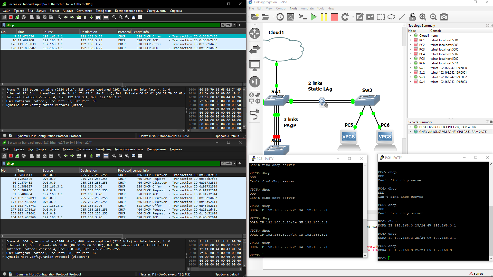
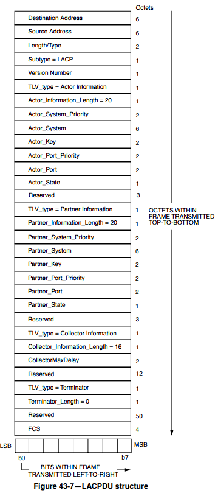

# Link Aggregation Control Protocol - Протокол Контроля Агрегации Каналов (Соединений)

## Задача

Объединение  нескольких физических каналов в один логический канал/интерфейс.

## Основная информация

**Стандарт:** 802.3ad – Агрегация каналов

**Размерность:** Объединение, до 8 активных физических каналов, и 8 резервных (В ожидании)

**Тип:** 0x8809

## Требования к использованию LACP

- Каналы должны быть одинаково настроены;
  - Пропускная способность/скорость;
  - Настройками LACP на устройстве;
  - Тип канала/интерфейса;
  - *Режим дуплекса;*
  - *Native VLAN;*
  - *Диапазон разрешённых VLAN;*
  - *Trunking status;*
- *Сеть должна быть одноранговой - P2P;*
- *В некоторых случаях, использование LACP невозможно, если используются порты не из одного блока коммутатора;*

## Преимущества (перед статической типизацией)

- **Цена:** обеспечение более медленных каналов дешевле, чем обеспечение следующего тира каналов;
- **Резервирование:** в случае недееспособности одного из каналов, другие продолжают распределять нагрузку между собой – работать;
- **Отсутствие петель:** т.к. LACP формирует интерфейс, объединяя физические каналы в один логический, то обращение к этому интерфейсу не может вызвать петель, ибо он один;

## Недостатки

- **Итоговая скорость:** даже если взять 8 физ. каналов со скоростью 1 Гб\с, он будет медленнее 1 канала со скоростью в 10 Гб\с;
- **Задержки при вычислениях:** для распределения трафика по физ. каналам осуществляются операции, чтобы понять по какому каналу пустить пакеты, а значит это немного замедляет сам трафик. (Как пример, регулировщик на дороге);

## Работа протокола

### Соединение\Создание логического канала

Для установления связи LACP рассылает по всем канала, для которых включён протокол, Multicast пакеты, по MAC-адресу *01:80:C2:00:00:02*, в случае используемого на другом устройстве LACP, устройства начнут независимо отправлять пакеты по каналам, тем самым обнаружить используемые каналы между устройствами с последующим преобразованием их в один логический интерфейс.

Каждую секунду отсылает пакеты с данными.

Не добавляет/изменяет заголовки

### Режимы работы

- **Активный:** всегда пытается создать логический канал;
- **Пассивный:** начинает рассылку пакетов лишь тогда, когда получает LACP-пакет. Если получает LACP пакет, то устанавливает соединение с ним;

### *Режимы синхронизации*

- **Медленный:** посылает пакет каждые 30 секунд, чтобы узнать в порядке ли соединение;
- **Быстрый:** посылает пакет каждую секунду;

### Режимы балансировки

-	**По MAC-адресу:** Получателя или Отправителя;
-	**По IP-адресу:** Получателя или Отправителя;
-	***По порту:** Получателя или Отправителя или Обоих;*

### *Распределение трафика*

Распределение трафика происходит по алгоритму, на который поступает (Входные данные) MAC-, IP- адрес или номер порта, а результатом является число от 1 до 8, обычно.

## Источники информации

- [Cisco](https://www.cisco.com/c/en/us/td/docs/ios/12_2sb/feature/guide/sbcelacp.html);
- [Wiki. Link aggregation](https://en.wikipedia.org/wiki/Link_aggregation);
- [ieee802 frazier](https://ieee802.org/3/hssg/public/apr07/frazier_01_0407.pdf);
- [IBM: LA configuration](https://www.ibm.com/docs/en/aix/7.1?topic=aggregation-ieee-8023ad-link-configuration);
- [Тема 17. Агрегирование. Portchannel Etherchannel PAgP LACP](https://www.youtube.com/watch?v=0giUsCqvxDs&t=656s);
- [Что такое и как настроить Link Aggregation Control Protocol (LACP) на примере Cisco](https://pyatilistnik.org/lacp-cisco/);
- [Основы компьютерных сетей. Тема №8. Протокол агрегирования каналов: Etherchannel](https://habr.com/ru/articles/334778/);
- [Общие сведения о агрегирования каналов и LACP [чаво]](https://community.fs.com/ru/article/understanding-link-aggregation-control-protocol.html);
- [Habr. Протокол агрегирования каналов: Etherchannel](https://habr.com/ru/articles/334778/);
- [LearnDuty. LACP Port Channel Explained (Link Aggregation Deep Dive)](https://learnduty.com/network-techs/lacp-port-channel-explained-link-aggregation-deep-dive/);
- [Nag wiki. LACP и агрегация портов](https://nag.wiki/pages/viewpage.action?pageId=25108332);
- [Carrier Sense Multiple Access with Collision Detection (CSMA/CD) access method and physical layer specifications](http://magrawal.myweb.usf.edu/dcom/Ch3_802.3-2005_section3.pdf)

### LACPDU из Cisco Packet Tracer

