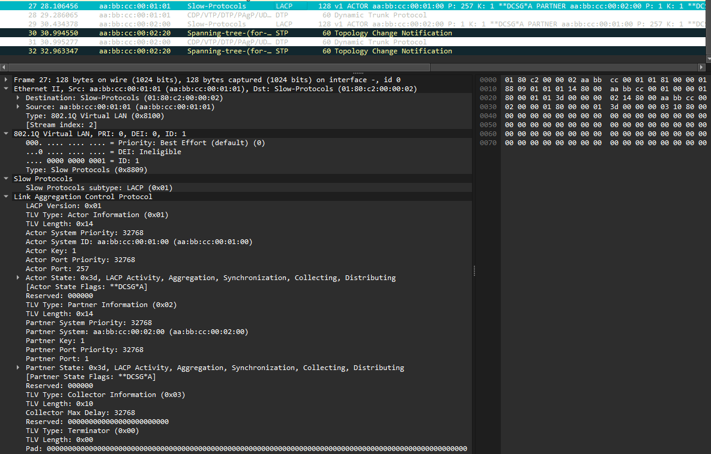
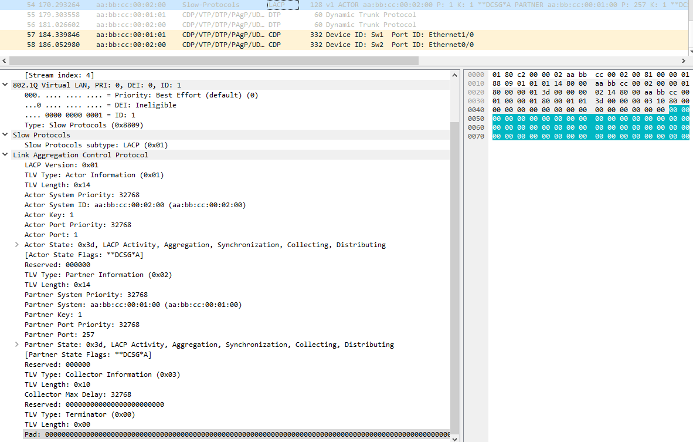

# Link Aggregation Control Protocol - Протокол контроля агрегирования каналов

## Основная информация

LACP - основной протокол динамического агрегирования каналов. Всё, что применимо к агрегированию каналов (условия работы, распределение и балансировка), применимо и для данного протокола.

## Работа протокола

Устройства с включённым LACP обмениваются сообщениями в виде пакетов `LACPDU` - LACP Data Unit.  
Основными лицами общения являются `actor` и `partner` (Далее *актёр* и *партнёр*), где актёр - всегда устройство отправляющее сообщение партнёру - соседнему устройству в логическом канале.

Протокол следуют следующим принципам при работе:

1) Протокол зависит от передачи информации и состояния, а не от передачи команд. Иными словами, LACPDU, отправленные первой стороной (актёром), передают второй стороне (партнёру актёра по протоколу) то, что актёр знает, как о своем состоянии, так и о состоянии своего партнёра;
2) Информации, содержащаяся в протоколе, достаточно для того, чтобы партнёр мог определить, какие действия следует предпринять дальше.
3) Порт логического канала может быть в одном из двух режимов активности: `active` или `passive` (Далее *активный* и *пассивный*). Пассивный режим указывает на готовность порта участвовать в протоколе, только в том случае, если поступило сообщение от партнера. Активный же указывает на желание порта участвовать в протоколе независимо от режима партнёра.
4) Существует `timeout time` (Далее *время ожидания*), который является количеством времени в сек. до аннулирования полученной информации LACPDU на устройстве. Оно может принимать одно из двух значений: `short` или `long` (Далее *короткий* и *длинный*). При длинном периоде, который является частотой по умолчанию, время ожидания равно 90 секундам. При коротком - 3 секунды.
5) В дополнение к периодическому обмену LACPDU, протокол передает DU, когда возникает необходимость что-либо сказать партнёру; т.е. когда меняется состояние актёра или когда из PDU партнёра очевидно, что партнёр не знает текущего состояния актёра.
6) Протокол предполагает, что вероятность потери пакета LACPDU очень низкая*.

*Примечание - LACP не осуществляет механизм обнаружения потери пакета, но 5-ый принцип разрешает потенциальные проблемы данного рода*

### Уточнение по режиму активности

При конфигурации LACP, порты могут быть в одном из двух режимов:

- **Active** - всегда пытается создать логический канал
- **Passive** - образует логический канал, только после предложения другого устройства

Ниже представлена таблица инициализации логического канала при использовании разных вариаций режимов портов, где "Да" - будет и "Нет" - не будет.

|             | active | passive |
| ----------: | :----: | :-----: |
|  **active** |   Да   |   Да    |
| **passive** |   Да   |   Нет   |

### LACP Data Unit

Стоит сообщить, что LACP является `slow` - *медленным* протоколом. О медленных протоколах можно почитать на [ieee802.org](https://ieee802.org/3/axay/comments/D1.2/8023-57a_b_SG15_response.pdf).  
Всё, что нужно знать - медленные протоколы отправляют не более 10 пакетов в секунду, их 802.1Q тип равен `0x8809`, а также все их пакеты имеют постоянный multicast адрес назначения - `01:80:c2:00:00:02`.

Пакет LACPDU содержит следующую информацию о состояниях актёра\* и партнера:

1) Порт актёра  
   *Идентификатор, присвоенный физическому порту локальной системой (системой, отправляющей PDU). Этот идентификатор не используется протоколом напрямую, но включен для использования при отладке.*
2) Система актёра  
   *Системный идентификатор\*\* локальной системы*
3) Ключ актёра  
   *Ключ канала\*\*\**
4) Состояние актёра  
   *Параметр, состоящий из следующих побитных флагов*
   1) Режим активности: 1 - `active`, 0 - `passive`.
   2) Время ожидания: 1 - длинное, 0 - короткое.
   3) Агрегирование: 1 - канал может быть агрегированным, 0 - не может.  
      *Подробнее об этом можно почитать в источнике [2].*
   4) Синхронизация: 1 - актёр совместим группой агрегирования, в которой он находится; 0 - нет.  
      *Подробнее об этом можно почитать в источнике [2].*
   5) Сбор: 1 - сбор входящих пакетов включён, 0 - нет.
   6) Отправка: 1 - отправка исходящих пакетов включена, 0 - нет.
   7) *По-умолчанию*: 1 - актёр оперирует оперативной информацией партнера по умолчанию, административно настроенной для партнера; 0 - нет.  
      *Подробнее об этом можно почитать в источнике [2].*
   8) Срок годности: 1 - у *машины приёма* актёра истёк срок годности, 0 - нет.  
      *Подробнее об этом можно почитать в источнике [2].*  
      *Данный флаг не используется LACP, но используется в диагностике проблем сети.*
5) Порт партнера
6) Система партнера
7) Ключ партнера
8) Состояние партнера

*\*актёр - отправитель*  
*\*\*System ID - глобальный уникальный идентификатор, используемый для идентификации системы, являющийся индивидуальным MAC-адресом. Сам адрес может быть связанным с одним из физ. каналов логического канала LACP*  
*\*\*\*Key - идентификатор, основанный на параметрах канала (режим дуплекса, пропускная скорость и т.п)*

Ниже представлена полная структура пакета LACPDU.


Поподробнее о неупомянутых параметрах можно почитать в источнике [2]. 

#### Пример пакета LACPDU, захваченного в Wireshark




### Настройка LACP в коммутаторе. На примере Cisco 

```console
Sw1(config)#interface ethernet 0/0
Sw1(config-if)#shutdown
Sw1(config-if)#channel-group 10 mode active
Creating a port-channel interface Port-channel 10
Sw1(config-if)#no shutdown
```

Также можно настроить различные параметры LACP. Пример можно найти в [документации Cisco](https://www.cisco.com/c/en/us/td/docs/routers/nfvis/switch_command/b-nfvis-switch-command-reference/lacp__commands.html?ysclid=m1v5rr79ek641137307#wp6606968980).

## Дополнительная информация

### Используемые ресурсы

1. [Link Aggregation and Ethernet Bonding](https://www.alliedtelesis.com/sites/default/files/documents/configuration-guides/linkag_feature_overview_guide.pdf)
2. [IEEE Std 802.3ad-2000](http://www.ccec.me:81/txzj/bzgf/802.3ad-2000.pdf)