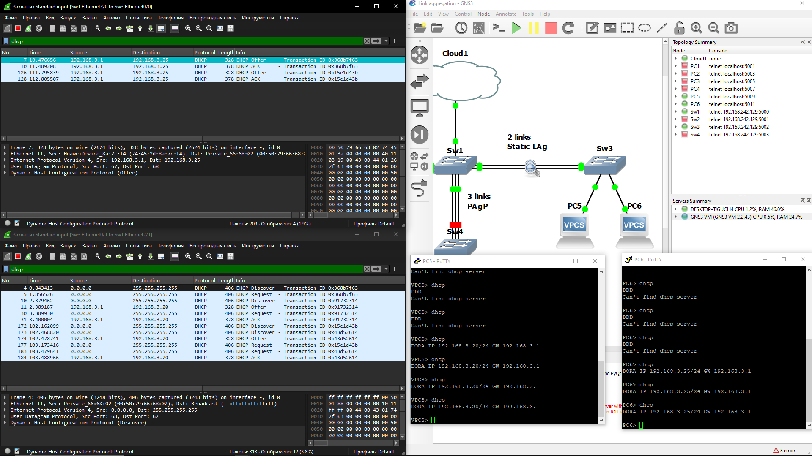

# Link aggregation - Агрегирование каналов

## Основная информация

### Что и зачем?

**Агрегирование каналов** - механизм объединения до *16\** физических каналов в один логический.

Стандарт IEEE 802.3ad - "Link aggregation for parallel links".  
Механизм работает на *2-4\*\**-ом уровне TCP\OSI.

Данная технология применяется для:
- Резервирование каналов
- Увеличение общей пропускной способности
- Балансировка нагрузки на каналы

*\* - максимальное количество объединённых каналов - 16, из которых 8 - резервные.*  
*\*\* - в зависимости от выбора алгоритма [распределения нагрузки](#распределение-и-балансировка-нагрузки)*

### Условия работы агрегирования

- Логический канал должен проходить между двумя устройствами
- Одинаковая пропускная способность (100 Mb/s, 1 Gb/s и т.д.)
- Одинаковый способ передачи (Витая пара, оптоволокно)
- Одинаковый 802.1Q
  - Тип: Access, trunk
  - Настройки VLAN
- Одинаковый режим дуплекса (полный, полу)

### Типы агрегирования

|                       Качества \ Тип |       Статическое        |              Динамическое               |
| -----------------------------------: | :----------------------: | :-------------------------------------: |
|                         Конфигурация | Ручная на каждой стороне | Автоматическая за счёт LACP или *PAgP** |
|     Согласование конфигураций сторон |           Нет            |                   Да                    |
| Задержка при обновлении конфигурации |           Нет            |                   Да                    |

*\* - проприетарный Cisco протокол*

#### Link Aggregation Control Protocol - LACP

Подробнее о LACP написано [здесь](./LACP.md).

### Распределение и балансировка нагрузки

Для распределения пакетов используется алгоритм, получающий на вход данные пакетов (например MAC/IP-адрес получателя/отправителя) и отдающий номер физического канала (внутри логического), по которому пойдёт пакет.  
Из примеров подобного алгоритма: хеш-алгоритм и/или результат остатка от деления на количество портов в канале.

Балансировка достигается за счёт настроек вышеуказанного алгоритма. Для этого предполагается выбор типа алгоритма. Примеры:
- MAC-адрес получателя/отправителя
- IP-адрес получателя/отправителя
- *UDP/TCP порт получателя/отправителя*\*
- MAC-адрес получателя и отправителя (XOR)
- IP-адрес получателя и отправителя (XOR)

*\* - поддерживается не всеми устройствами*

Конфигурация алгоритма распределения возможна с обеих сторон, но можно выбрать только один алгоритм на устройстве. Например, имеется 3 агрегированных группы: static, LACP x2, то алгоритм балансировки будет единым для всех групп.

### Настройка в консоли

```console
Sw(config)#interface range fastEthernet 1/0 - 1
Sw(config-if-range)#shutdown
Sw(config-if-range)#channel-group 2 mode ?
  active     Enable LACP unconditionally
  auto       Enable PAgP only if a PAgP device is detected
  desirable  Enable PAgP unconditionally
  on         Enable Etherchannel only
  passive    Enable LACP only if a LACP device is detected
Sw(config-if-range)#channel-group 2 mode on
Creating a port-channel interface Port-channel2
Sw(config-if-range)#no shutdown

-- Checking --
Sw#show etherchannel summary
Flags:  D - down        P - in port-channel
        I - stand-alone s - suspended
        R - Layer3      S - Layer2
        U - in use
Group Port-channel  Ports
-----+------------+-----------------------------------------------------------
2     Po2(SU)     Fa1/0(P)   Fa1/1(P)

-- Don't forget to repeat configuring LAg on another side --

-- Configuring load-balancing algorithm --
Sw(config)#port-channel load-balance ?
  dst-ip       Dst IP Addr
  dst-mac      Dst Mac Addr
  src-dst-ip   Src XOR Dst IP Addr
  src-dst-mac  Src XOR Dst Mac Addr
  src-ip       Src IP Addr
  src-mac      Src Mac Addr

Sw(config)#port-channel load-balance dst-mac
Warning: Delete and re-create existing port channels to apply new load balance method to them
```

### Пример работоспособности с использованием Wireshark



## Дополнительная информация

### Используемые ресурсы

1. [Википедия](https://ru.wikipedia.org/wiki/Агрегирование_каналов) & [Wikipedia](https://en.wikipedia.org/wiki/Link_aggregation)
2. [Link Aggregation and Ethernet Bonding](https://www.alliedtelesis.com/sites/default/files/documents/configuration-guides/linkag_feature_overview_guide.pdf)
3. [Протокол агрегирования каналов: Etherchannel](https://habr.com/ru/articles/334778/)