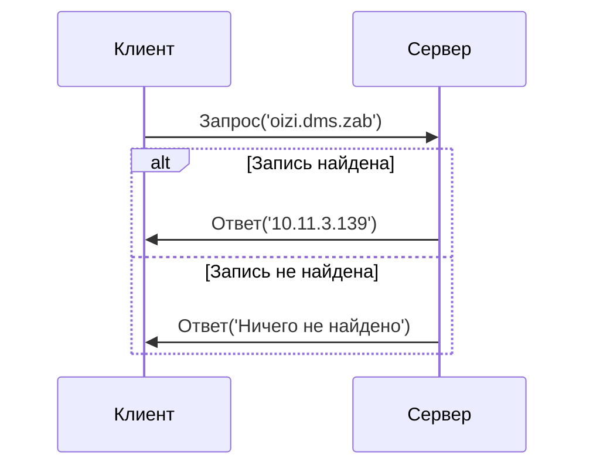

# DNS клиент и сервер

Курсовая работа на тему "DNS клиент и сервер" реализованная на Rust.

## Принцип работы

### Обмен сообщениями

## Структуры

### DNS запись

- доменное имя: строка;
- адрес: IPv4;

### Данные пакета

- идентификатор запроса: 2 байта;
- длина разрешаемого доменного имени в байтах - `a`: 1 байт;   
- разрешаемое доменное имя: `a` байт;
- разрешёно ли имя: 1 байт (0 - не разрешён, 1 - разрешён);
- разрешённый адрес: 4 байта;

### DNS сервер

- таблица DNS записей: коллекция DNS записей;
- UDP сокет: UDP сокет;

### DNS клиент

- коллекция кешированных DNS записей: коллекция DNS записей;
- путь к файлу hosts;
- UDP сокет: UDP сокет;

### Контроллер таблицы DNS записей

- путь к файлу таблицы записей: строка;
