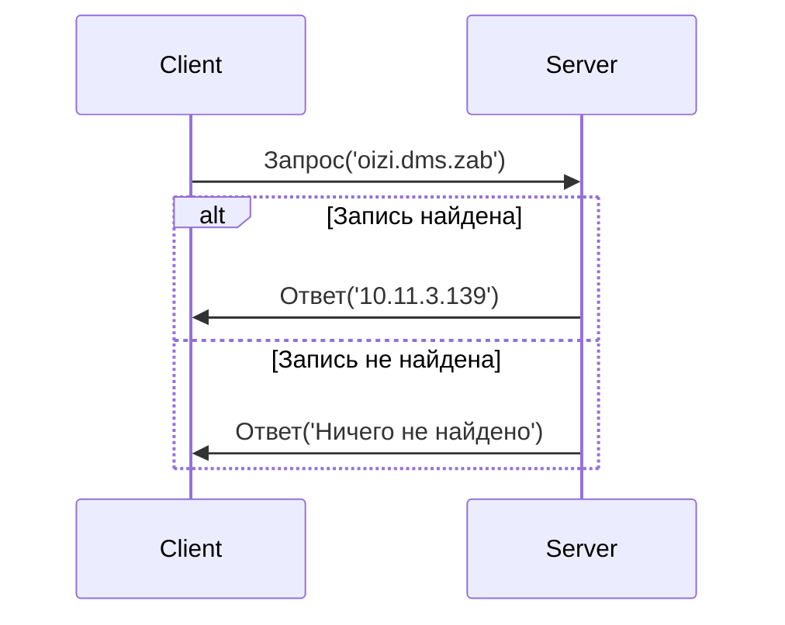

# DNS клиент и сервер

Курсовая работа на тему "DNS клиент и сервер" реализованная на Rust.

## Принцип работы

### Обмен сообщениями

## Структуры

### DNS запись

- доменное имя: строка;
- адрес: IPv4;

### Данные пакета

- идентификатор запроса: 16 бит;
- DNS запрос: строка;
- DNS ответ: IPv4 / none;

### DNS сервер

- таблица DNS записей: коллекция DNS записей;
- UDP сокет: UDP сокет;

### DNS клиент

- коллекция кешированных DNS записей: коллекция DNS записей;
- путь к файлу hosts;
- UDP сокет: UDP сокет;

### Контроллер таблицы DNS записей

- путь к файлу таблицы записей: String;
